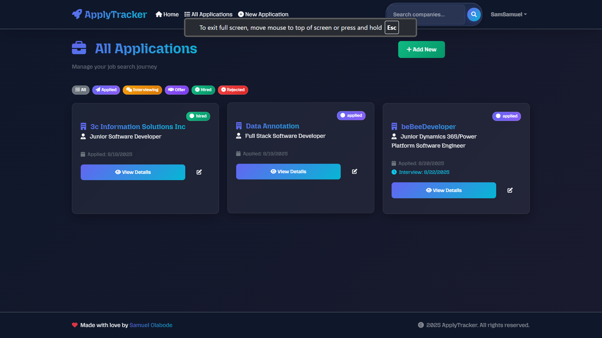
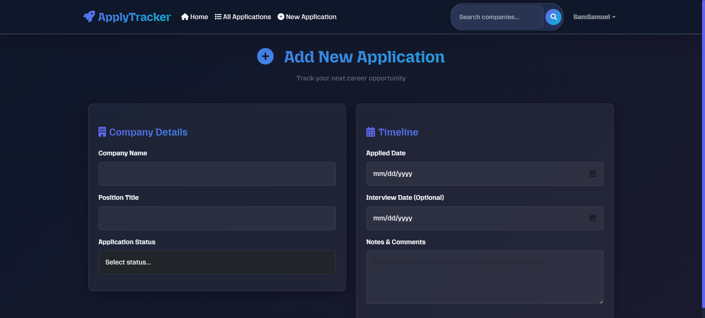
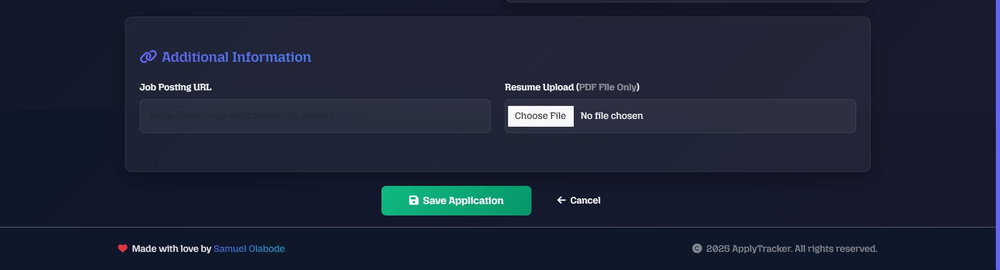
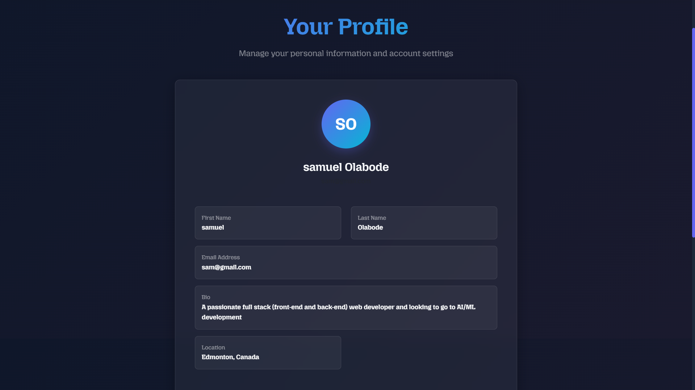
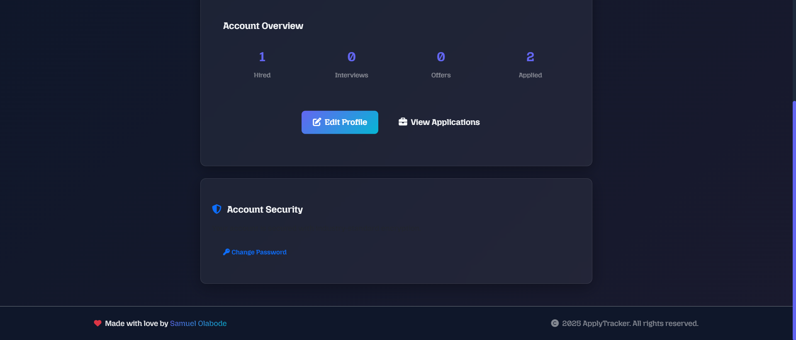
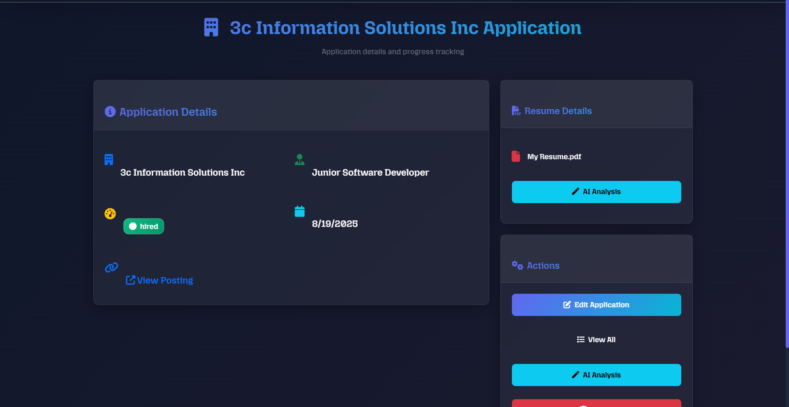
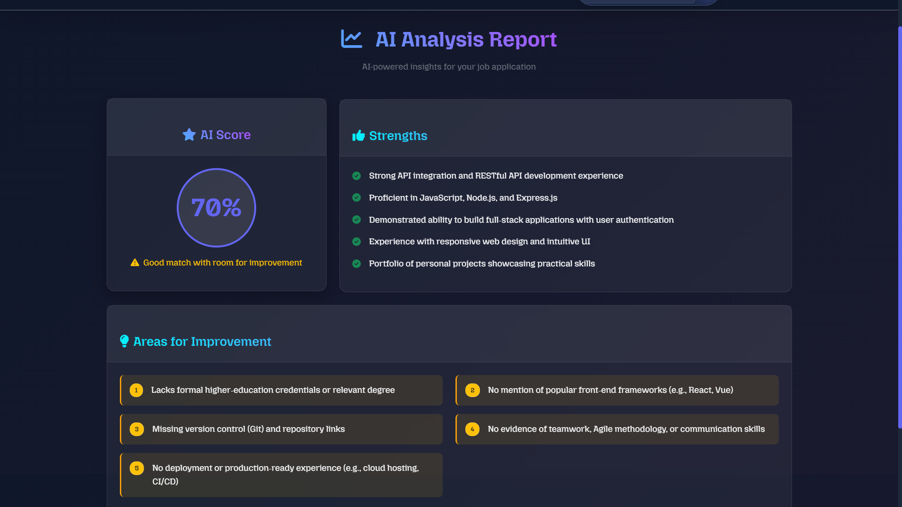

# ApplyTracker - Job Application Management System

ApplyTracker is a comprehensive web application designed to help job seekers track their job applications, analyze resume compatibility with job postings using AI, and manage their job search process efficiently.

## 🚀 Features

### Core Functionality
- **Application Tracking**: Track job applications with company details, position, status, and dates
- **Resume Upload**: Upload and store PDF resumes for each application
- **AI-Powered Analysis**: Analyze resume compatibility with job postings using Groq AI
- **Status Management**: Track application progress through stages (applied, interviewing, offer, hired, rejected)
- **Search & Filter**: Search applications by company name and filter by status

### User Management
- **User Authentication**: Secure login/signup with Passport.js
- **User Profiles**: Manage personal information, bio, location, and website
- **Password Management**: Change password functionality

### Technical Features
- **File Upload**: Resume file handling with Multer
- **PDF Processing**: Extract text from PDF resumes for analysis
- **Caching**: Intelligent caching for AI analysis results
- **Error Handling**: Comprehensive error handling and user feedback

## Screenshots









## 🛠️ Tech Stack

### Backend
- **Node.js** - Runtime environment
- **Express.js** - Web framework
- **MongoDB** - Database with Mongoose ODM
- **Passport.js** - Authentication middleware
- **Multer** - File upload handling
- **Joi** - Data validation

### Frontend
- **EJS** - Templating engine
- **EJS-Mate** - Layout templates
- **CSS** - Custom styling
- **JavaScript** - Client-side functionality

### AI Integration
- **Groq SDK** - AI-powered resume analysis
- **PDF-Parse** - PDF text extraction

## 📦 Installation

1. **Clone the repository**
   ```bash
   git clone <https://github.com/DevOlabode/apply-tracker-final>
   cd applyTracker
   ```

2. **Install dependencies**
   ```bash
   npm install
   ```

3. **Environment Setup**
   Create a `.env` file in the root directory with the following variables:
   ```env
   PORT=3000
   SECRET=your-secret-key-here
   GROQ_API_KEY=your-groq-api-key-here
   ```

4. **Database Setup**
   Ensure MongoDB is running locally on `mongodb://127.0.0.1:27017/application`

5. **Start the application**
   ```bash
   npm start
   ```

## 🔧 Configuration

### Environment Variables
- `PORT`: Server port (default: 3000)
- `SECRET`: Session secret for authentication
- `GROQ_API_KEY`: Groq API key for AI analysis

### Database
The application uses MongoDB with the following collections:
- `users`: User authentication and profile data
- `applications`: Job application tracking data

## 🎯 Usage

### Application Management
1. **Create Application**: Add new job applications with company details, position, and resume
2. **Track Status**: Update application status through the hiring pipeline
3. **Analyze Resume**: Get AI-powered analysis of resume compatibility with job postings
4. **Search & Filter**: Find applications by company or filter by status

### Resume Analysis
1. Upload a PDF resume with your application
2. Click "Analyze Resume" to get AI-powered feedback
3. Receive compatibility score, strengths, and improvement suggestions

## 📁 Project Structure

```
applyTracker/
├── controllers/          # Route controllers
│   ├── applyTracker.js  # Application management
│   ├── auth.js          # Authentication
│   └── user.js          # User management
├── models/              # Database models
│   ├── apply.js         # Application schema
│   └── auth.js          # User schema
├── routes/              # Express routes
│   ├── applyTracker.js  # Application routes
│   ├── auth.js          # Authentication routes
│   └── user.js          # User routes
├── utils/               # Utility functions
│   ├── analyseResume.js # AI analysis logic
│   ├── catchAsync.js    # Async error handling
│   └── expressError.js  # Custom error class
├── views/               # EJS templates
│   ├── applyTracker/    # Application views
│   ├── auth/            # Authentication views
│   ├── user/            # User profile views
│   └── layout/          # Layout templates
├── public/              # Static assets
│   ├── css/             # Stylesheets
│   └── js/              # Client-side JavaScript
├── uploads/             # File upload directory
├── index.js             # Main application file
├── middleware.js        # Custom middleware
├── joiSchema.js         # Validation schemas
└── package.json         # Dependencies and scripts
```

## 🔄 API Endpoints

### Authentication
- `GET /login` - Login page
- `POST /login` - User login
- `GET /signup` - Signup page
- `POST /signup` - User registration
- `GET /logout` - User logout

### Applications
- `GET /application` - List all applications
- `GET /application/new` - New application form
- `POST /application` - Create new application
- `GET /application/:id` - View application details
- `GET /application/:id/edit` - Edit application form
- `PUT /application/:id` - Update application
- `DELETE /application/:id` - Delete application
- `GET /application/:id/analysis` - Analyze resume

### User Management
- `GET /user/:id` - User profile
- `GET /user/:id/edit` - Edit profile
- `PUT /user/:id` - Update profile
- `GET /user/change-password` - Change password form
- `PUT /user/change-password` - Update password

## 🎨 UI Features

- Responsive design
- Flash messages for user feedback
- Form validation
- File upload interface
- Status badges and visual indicators
- Search and filter functionality

## 🔒 Security Features

- Password hashing with passport-local-mongoose
- Session management with express-session
- CSRF protection
- File upload validation
- Input sanitization and validation
- Authentication middleware

## 🚦 Status Tracking

Applications can have one of the following statuses:
- **Applied** - Application submitted
- **Interviewing** - In interview process
- **Offer** - Received job offer
- **Hired** - Successfully hired
- **Rejected** - Application rejected

## 🤖 AI Analysis

The resume analysis feature uses Groq AI to:
- Compare resume content with job posting requirements
- Generate compatibility score (0-100)
- Provide specific strengths and improvement suggestions
- Cache results for performance optimization
- Handle API rate limiting and service outages gracefully

## 🚀 Deployment

### Prerequisites
- Node.js (v14 or higher)
- MongoDB database
- Groq API account

### Steps
1. Set up production environment variables
2. Configure MongoDB connection string
3. Install dependencies: `npm install --production`
4. Start the application: `npm start`

## 📝 License

This project is licensed under the ISC License.

## 🤝 Contributing

1. Fork the repository
2. Create a feature branch
3. Make your changes
4. Test thoroughly
5. Submit a pull request

## 🐛 Troubleshooting

### Common Issues
1. **MongoDB Connection Error**: Ensure MongoDB is running locally
2. **File Upload Issues**: Check uploads directory permissions
3. **AI Analysis Failing**: Verify GROQ_API_KEY is set correctly
4. **Authentication Issues**: Check session secret configuration

### Logs
Check console logs for detailed error information and debugging.

## 📞 Support

For issues and questions, please check:
1. Application console logs
2. MongoDB connection status
3. Environment variable configuration
4. File system permissions

---

**ApplyTracker** - Streamline your job search and make data-driven decisions with AI-powered resume analysis.
